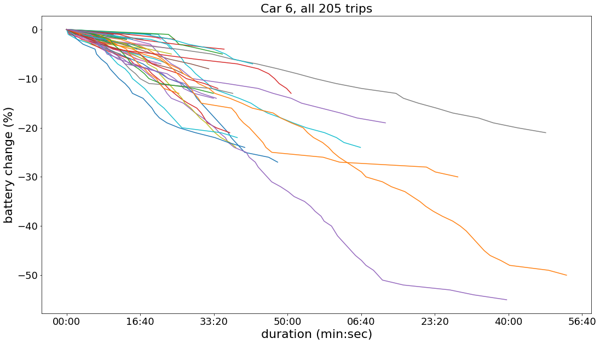
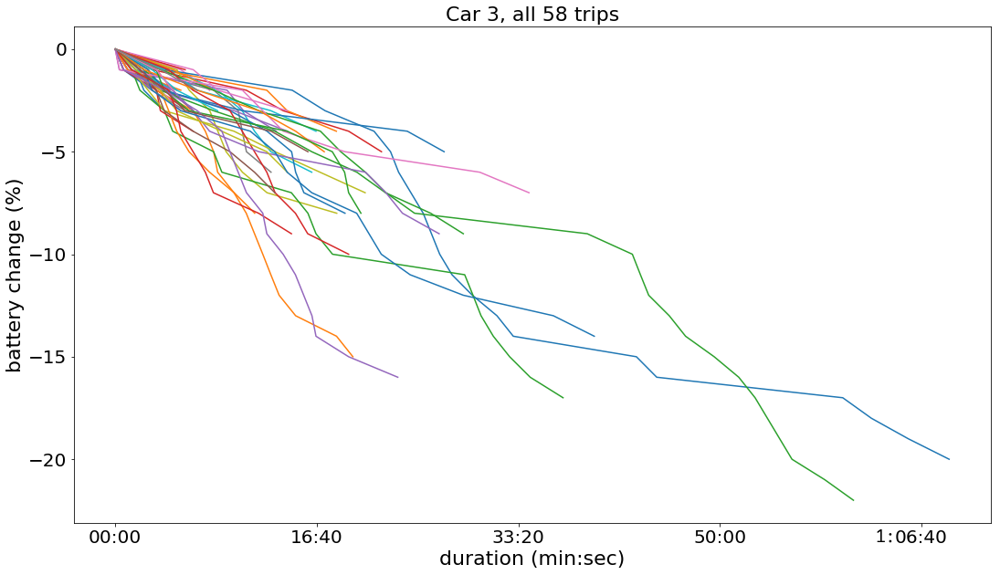
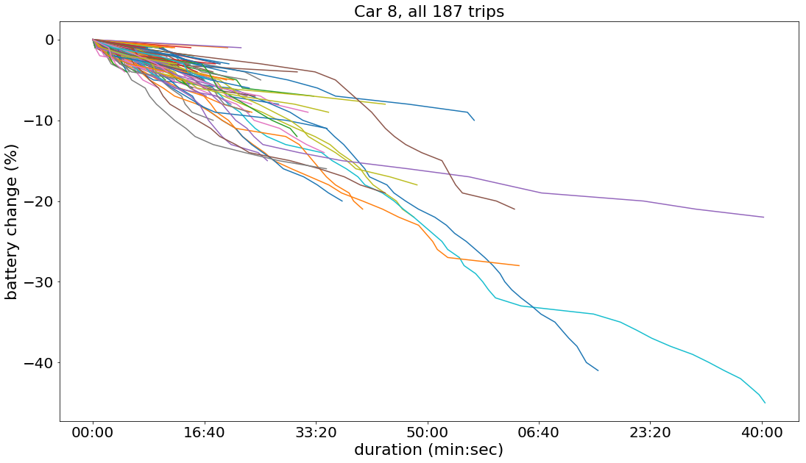
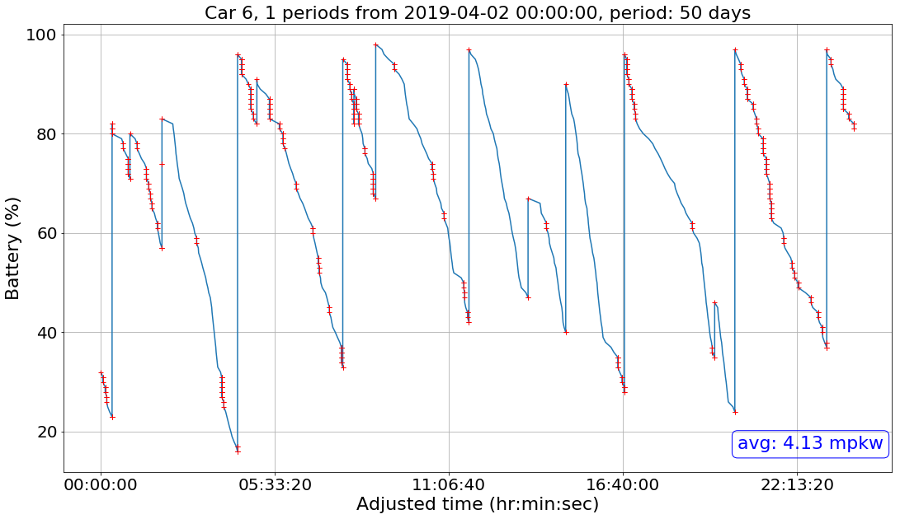
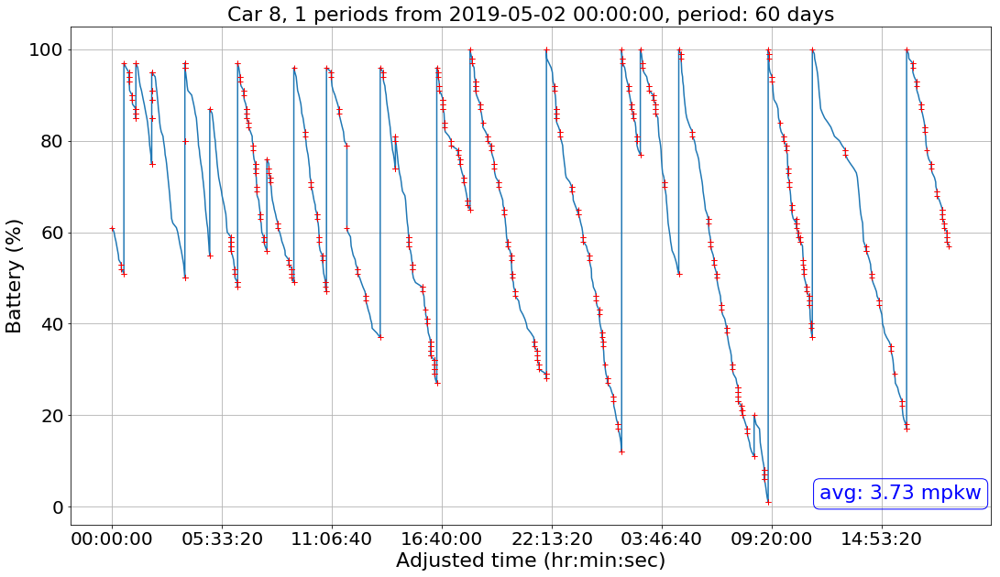
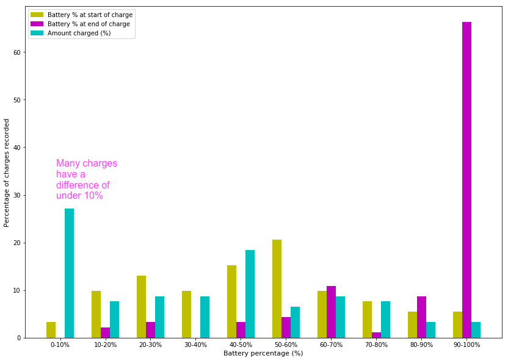
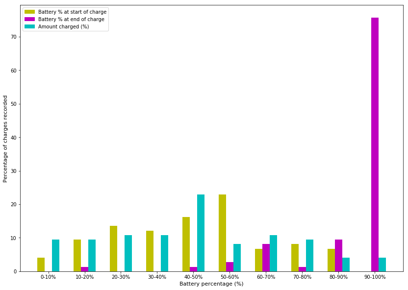

<h2>Graphing battery change during trips</h2>
Using [battPerTripVer2.py](battPerTripVer2.py)

<h2>Graphing battery change per car</h2>

<h2>Battery percentage increase after every charge</h2>
In the first graph, I noticed there were a lot of charges in the <10% bin. Looking into the data, there were a lot of charges recorded to have a battery change of 0% or 1%, which are clear errors.

This graph removes any charges that have a battery percentage difference of <3%.

