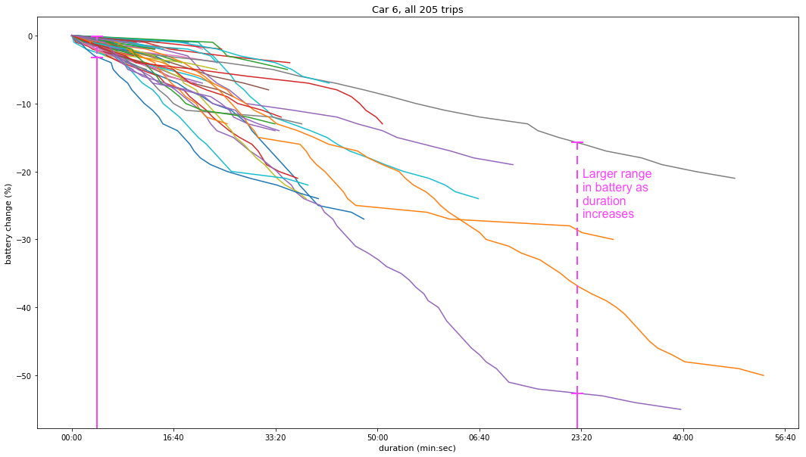

<h2>Graphing battery change during trips</h2>

Using: functions from 

[masterDFs.py](masterDFs.py)

and plot 2 in

[battAllTrips.py](battAllTrips.py)

Each line is a trip. 

Here we see the importance of EV Technology's app and predictive analysis using telematics data, as the change in battery gets harder to predict for trips with longer durations. Fleet managers would find it difficult to plan for trips if they only knew the duration (and possibly mileage although not included in this graph); for long trips, there is lots of uncertainty about how much battery is needed.

<h2>Graphing battery change per car</h2>

Using: functions from 

[masterDFs.py](masterDFs.py)

and plot 3 in

[battAllTrips.py](battAllTrips.py)

For these graphs, the start and end times of trips have been removed as I found that the start time often automatically chosen way before a trip is actually underway. Similarly for end times, they are often recorded much after a trip has finished. 

Observe the point at which drivers decide to charge their cars. Car 6 often uses the battery until it us below 40% and eventually so does car 8. Many drivers feel the need to charge once battery drops below 60%. If drivers learn to use their battery to the fullest before charging, they can get in more miles with less charging stops. This demonstrates the importance of driver education.

<h2>Battery percentage increase after every charge</h2>
In the first graph, I noticed there were a lot of charges in the <10% bin. Looking into the data, there were a lot of charges recorded to have a battery change of 0% or 1%, which are clear errors.

This graph removes any charges that have a battery percentage difference of <3%.

